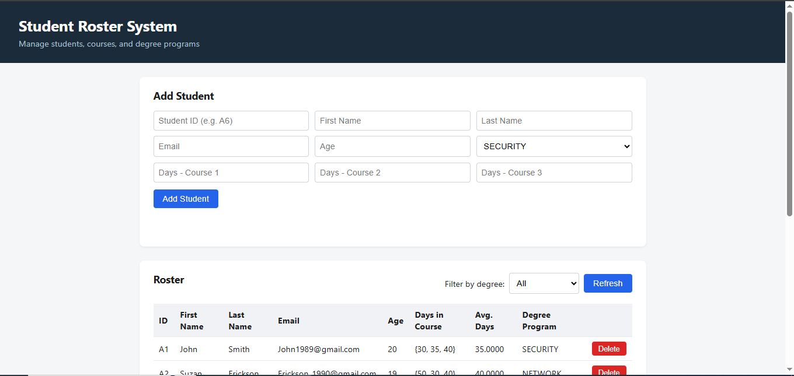
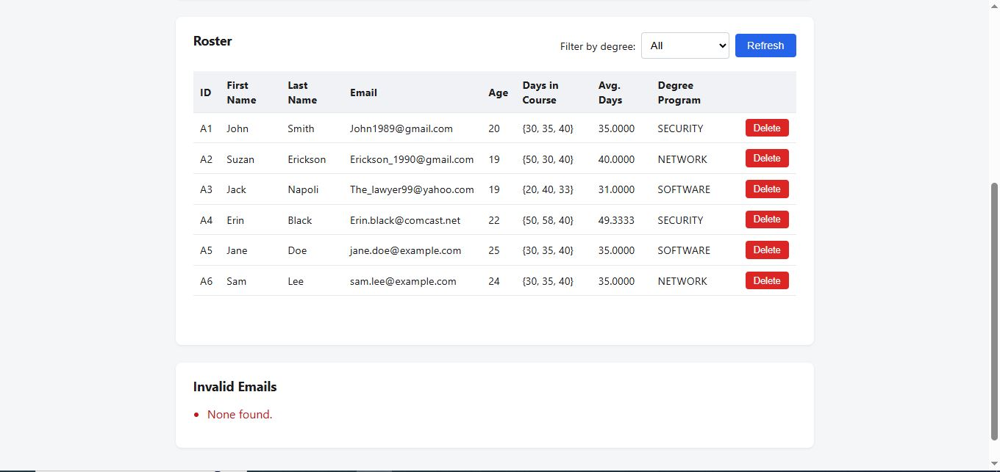

# Student Roster System

A student records system built in C++, evolved from a simple in-memory console
exercise into a full-stack application with persistent storage, a REST API,
a web frontend, and a unit test suite.


 





[Watch a demo video (0:31)](docs/screenshots/roster-demo.mp4)


## What It Does

Manages a roster of students (ID, name, email, age, days-to-complete for three
courses, and degree program), with the ability to:

- Add and remove students
- View the full roster, sorted by student ID
- Filter students by degree program (Security, Network, Software)
- Calculate a student's average number of days across their three courses
- Detect and report invalid email addresses in the dataset

The same underlying logic is exposed two ways: a console demo (`roster.exe`)
and a REST API + browser frontend (`roster_server.exe` + `frontend/`).

## Tech Stack

- **Core logic:** C++17 (`Student` and `Roster` classes)
- **Persistence:** SQLite3 (vendored amalgamation, no external DB server required)
- **REST API:** [cpp-httplib](https://github.com/yhirose/cpp-httplib) + [nlohmann/json](https://github.com/nlohmann/json) (both header-only)
- **Frontend:** Plain HTML/CSS/JavaScript, no build tooling
- **Testing:** [Catch2](https://github.com/catchorg/Catch2) (single-header)
- **Compiler:** MSVC (Visual Studio 2022 Build Tools)

## Project Structure

```
student-roster-system/
├── degree.h                 # DegreeProgram enum
├── student.h / student.cpp   # Student data class
├── roster.h / roster.cpp     # SQLite-backed roster management
├── main.cpp                  # Console demo entry point
├── main_server.cpp           # REST API server entry point
├── frontend/                 # HTML/CSS/JS client for the REST API
├── tests/tests.cpp           # Catch2 unit tests
└── third_party/               # Vendored header-only/amalgamation libraries
```

## Architecture Notes

- **Why SQLite over the original in-memory array:** the original version stored
  students in a fixed-size array of raw pointers with manual `new`/`delete`.
  It was rebuilt on `std::vector<Student>` first (removing manual memory
  management entirely), then migrated to SQLite so data actually persists
  between runs instead of disappearing when the program exits.
- **Why two entry points:** `main.cpp` and `main_server.cpp` share the same
  `Student`/`Roster` logic but expose it differently — one as a scripted
  console demo, one as an HTTP API. This keeps the business logic decoupled
  from any specific interface.
- **Input validation:** the REST API validates email format and rejects
  duplicate student IDs on creation (`POST /students`), while the underlying
  `printInvalidEmails()` / `getInvalidEmails()` functions exist to audit
  pre-existing or externally-imported data that may not have passed through
  that validation (e.g., the original CSV-based seed data).

## Building and Running

Requires Visual Studio 2022 (Community or higher) with the C++ build tools installed.

**Console demo:**
```
cl /EHsc /std:c++17 /I third_party/sqlite main.cpp student.cpp roster.cpp third_party/sqlite/sqlite3.c /Fe:roster.exe
roster.exe
```

**API server:**
```
cl /EHsc /std:c++17 /I third_party/sqlite /I third_party/httplib /I third_party/json main_server.cpp student.cpp roster.cpp third_party/sqlite/sqlite3.c /Fe:roster_server.exe /link ws2_32.lib
roster_server.exe
```

Then open `frontend/index.html` in a browser while the server is running.

**Tests:**
```
cl /EHsc /std:c++17 /I . /I third_party/sqlite /I third_party/catch2 tests/tests.cpp student.cpp roster.cpp third_party/sqlite/sqlite3.c /Fe:tests.exe
tests.exe
```

## API Endpoints

| Method | Path | Description |
|---|---|---|
| GET | `/students` | List all students |
| GET | `/students/:id` | Get a single student |
| GET | `/students/:id/average` | Average days across a student's courses |
| GET | `/students/invalid-emails` | List invalid email addresses in the dataset |
| GET | `/students/degree/:program` | Filter by degree program |
| POST | `/students` | Add a student (JSON body) |
| DELETE | `/students/:id` | Remove a student |

## Known Limitations

- **No live demo:** this app persists data to a local SQLite file, which
  doesn't survive the ephemeral filesystem on most free-tier hosting
  platforms. Rather than deploy a live version that silently resets its
  data, this stays local-run-only for now — clone it and follow the build
  steps above to see it working with real persistence intact.
- Single-user, single-database-file design — no authentication or
  multi-tenant support (out of scope for this project's purpose).


## License

MIT — see [LICENSE](LICENSE).
